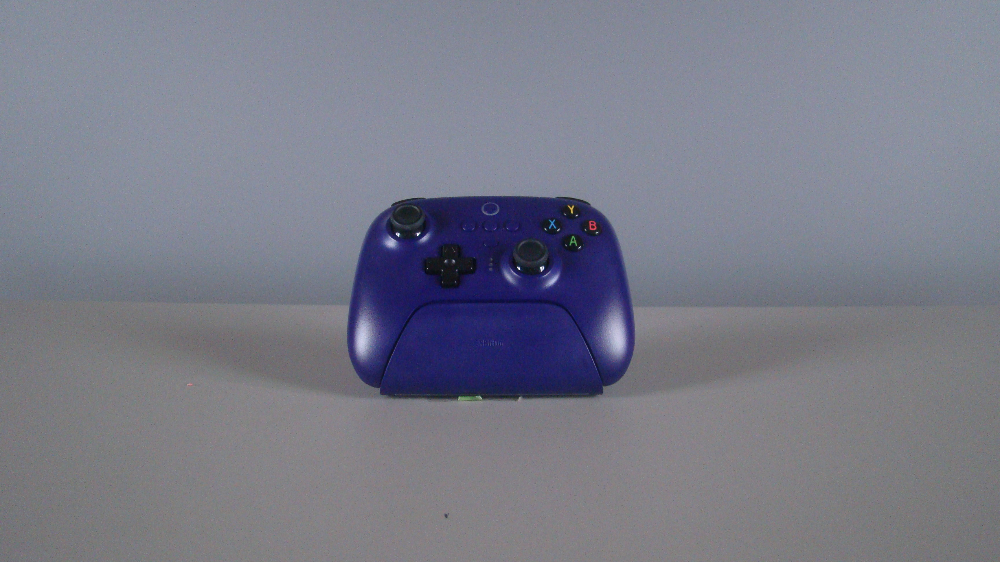
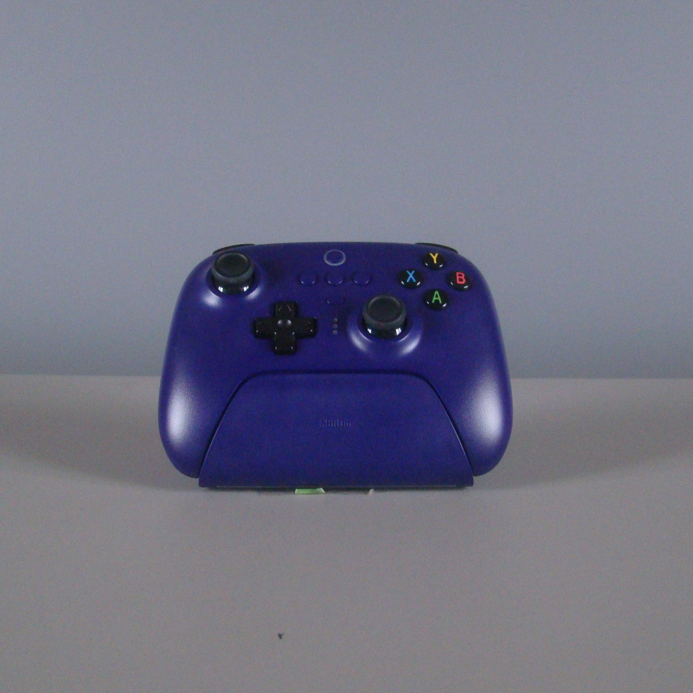
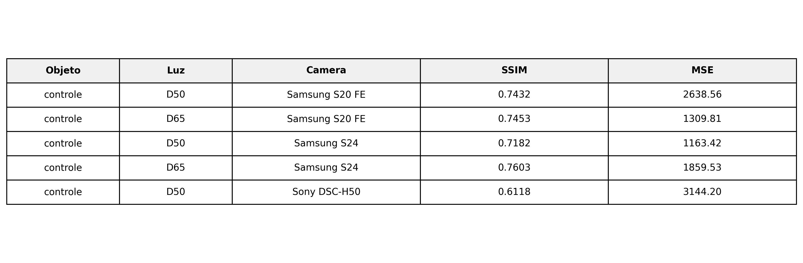

# Trabalho 3 de Imagem e Vídeo

- [André Okimoto](https://github.com/okiyud)
- [Fernando Lucas](https://github.com/FernandooLAN)
- [Guilherme Dias](https://github.com/correa-dias-gui)
- [Guilherme Louro](https://github.com/guilherme-louro)

Este repositório contém os scripts e as fotos (links abaixo) usados para comparar e gerar métricas entre fotos com diferentes fontes de luz.

[Fotos originais](https://drive.google.com/drive/folders/1gmJ7nPS_4rOuFIU8b-N-e6tUvaDFvEpO?usp=share_link)

[Fotos processadas](https://drive.google.com/drive/folders/1RU8Dbsqex2V2XzYmHbHOYwzIWc2AWk9T?usp=sharing)

## Pré-requisitos
Aqui estão todas as bibliotecas necessásrias para replicar o experimento. Crie um ambiente virtual (venv) e instale as seguintes dependências.

### Versões
```bash 
matplotlib==3.10.7
numpy==2.2.6
pandas==2.3.3
pillow==11.3.0
pillow_heif==1.1.1
scikit-image==0.25.2
scipy==1.16.3
```

### Comando para instalar
```bash
pip3 install pillow pillow-heif numpy pandas scikit-image matplotlib
```

## Procedimento

### 1. Renomear as imagens para identificar
Todos os arquivos originais foram renomeados para `<objeto>_<tipo de iluminação>_<câmera ou celular utilizado>.<formato>` com o intuito de identificar o objeto, tipo de iluminação e aparelho utilizado para capturar a foto.

### 2. Padronizar tamanho: recortar e redimensionar
Como as imagens eram de amostragens diferentes, a metodologia utilizada foi de pegar a menor imagem e usar sua altura como referência de tamanho. No caso do nosso experimento, a menor altura era a da imagem com a câmera Sony DSC-H50, na qual as imagens são de dimensões de 3456 × 1944. Abaixo, um exemplo da imagem original do controle com luz branca pela câmera Sony DSC-H50.



Em seguida, todas as imagens foram enquadradas e centralizadas com base na sua respectiva altura e, em seguida, foram reduzidas para a dimensão de 1944 x 1944. As imagens de referência deste trabalho, imagens com a câmera Sony DSC-H50, apenas foram enquadradas para a dimensão citada. Abaixo, um exemplo de uma imagem processada com luz branca.



Todo esse processamento é feito no arquivo `processamento.py`

### 3. Separação do dataset
Fez-se a comparação apenas entre imagens com o mesmo tipo de iluminação — branca com branca e amarela com amarela. Para organizar melhor o conjunto de dados, dentro de `imagens/processed/` foram criadas subpastas específicas para cada tipo de luz, como `branca/` e `amarela/`. Para identificar a luz, utilizou-se um dicionário para fazer o match entre a luz utilizada e seu significado. 

| Luz    | Classificação    |
|--------|------------------|
| inc100 | amarela forte    |
| inc40  | amarela fraca    |
| d65    | branca forte     |
| d50    | branca fraca     |

### 4. Experimento
Finalmente, foi realizado o experimento através do arquivo `calcular_metricas.py`. Foi gerado um arquivo CSV `resultados_metricas.csv` como saída para fazer as comparações.

### 5. Resultados
A partir do arquivo `resultados_metricas.csv`, foram gerados as tabelas de comparação através do arquivo `gerar_tabelas.py`do SSIM e MSE entre a imagem de referência e as demais imagens. Abaixo, o resultado da comparação para a imagem do controle com luz branca. 




